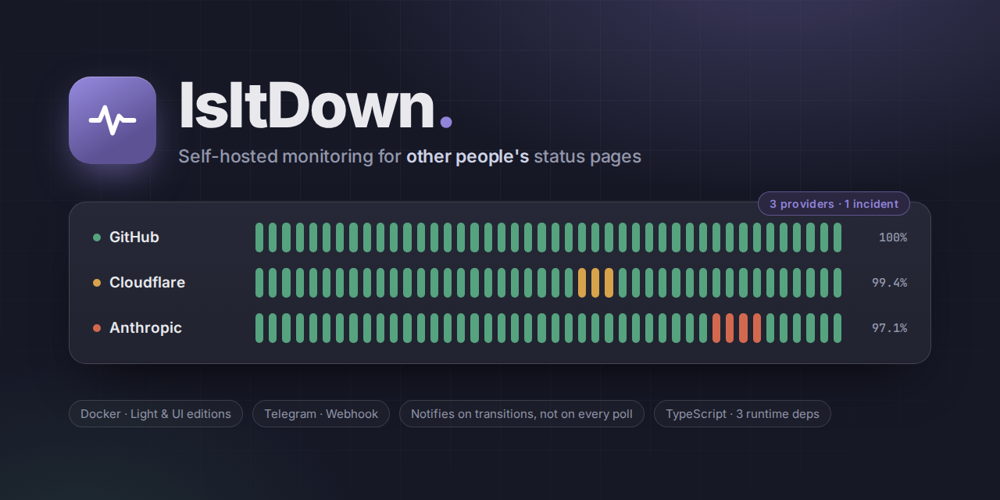

<p align="center">
  
</p>

# IsItDown

[](https://github.com/DevManfre/isitdown/releases)
[](.github/workflows/ci.yml)
[](LICENSE)
[](.nvmrc)
[](tsconfig.json)
[](#92-tech-stack)

[](#92-tech-stack)
[](#4-docker)
[](#82-localisation)

**English** · [Italiano](README.it.md)

Self-hosted, containerized monitoring for **other people's** status pages. It polls
the public status pages of the providers you depend on — GitHub, Cloudflare,
Anthropic, npm, anything running Atlassian Statuspage — and messages you when one
of them changes state.

It exists so a single developer or a small team gets early warning about upstream
trouble without keeping five status dashboards open. It notifies on *transitions*,
never on every poll, so a quiet week is a silent week.

Two editions from one codebase: **Light** (polling and notifications only, no
server) and **UI** (the same engine plus a local dashboard, configured at runtime).

## Contents

- [1. What it does](#1-what-it-does)
  - [Core principles](#core-principles)
  - [The two editions](#the-two-editions)
- [2. Quick start](#2-quick-start)
  - [2.1 With Docker](#21-with-docker)
  - [2.2 Without Docker](#22-without-docker)
- [3. Configuration](#3-configuration)
  - [3.1 Light edition — config.yml](#31-light-edition--configyml)
  - [3.2 UI edition — runtime settings](#32-ui-edition--runtime-settings)
  - [3.3 Environment variables](#33-environment-variables)
  - [3.4 How secrets are handled](#34-how-secrets-are-handled)
  - [3.5 Monitored providers](#35-monitored-providers)
  - [3.6 Notification channels](#36-notification-channels)
- [4. Docker](#4-docker)
  - [4.1 Images and build targets](#41-images-and-build-targets)
  - [4.2 Compose profiles](#42-compose-profiles)
  - [4.3 Volumes, healthchecks, users](#43-volumes-healthchecks-users)
- [5. Verifying a deployment](#5-verifying-a-deployment)
  - [5.1 Smoke checks](#51-smoke-checks)
  - [5.2 The dashboard](#52-the-dashboard)
  - [5.3 Configuration changes apply without a restart](#53-configuration-changes-apply-without-a-restart)
  - [5.4 End-to-end notification test](#54-end-to-end-notification-test)
  - [5.5 Testing Telegram](#55-testing-telegram)
  - [5.6 Troubleshooting](#56-troubleshooting)
- [6. HTTP API](#6-http-api)
- [7. How it works](#7-how-it-works)
  - [7.1 Data flow](#71-data-flow)
  - [7.2 Components](#72-components)
  - [7.3 When a notification fires](#73-when-a-notification-fires)
  - [7.4 Notification format](#74-notification-format)
  - [7.5 Resilience](#75-resilience)
- [8. Theming and localisation](#8-theming-and-localisation)
  - [8.1 Themes](#81-themes)
  - [8.2 Localisation](#82-localisation)
- [9. Development](#9-development)
  - [9.1 Repo structure](#91-repo-structure)
  - [9.2 Tech stack](#92-tech-stack)
  - [9.3 Live development](#93-live-development)
  - [9.4 Tests and checks](#94-tests-and-checks)
  - [9.5 Conventions](#95-conventions)
  - [9.6 Releasing](#96-releasing)
- [10. Roadmap](#10-roadmap)
- [11. Branch layout and merge policy](#11-branch-layout-and-merge-policy)
  - [Setup, once per clone](#setup-once-per-clone)
  - [Merging into main](#merging-into-main)
  - [What enforces it](#what-enforces-it)
  - [Consequences of keeping the filter off main](#consequences-of-keeping-the-filter-off-main)
  - [Rules of thumb](#rules-of-thumb)

---

## 1. What it does

Every few minutes IsItDown fetches each provider's status page, normalises the
answer, compares it with what it saw last time, and sends a message only if
something actually changed.

```
GitHub          operational    ████████████████████████████  99.98%
Cloudflare      degraded       ███████████████▁▁▁▁▁████████  99.61%   ← you get a message
Anthropic       operational    ████████████████████████████  99.93%
```

### Core principles

- **No external dependencies at runtime.** No database server, no message broker,
  no cloud account. A JSON file or an embedded SQLite file is enough at this scale.
- **Config-driven.** Adding a provider never means touching code — an entry in
  `config.yml` (Light) or a dialog in the dashboard (UI).
- **Idempotent notifications.** Only state *transitions* notify: operational →
  degraded, degraded → outage, outage → resolved. A restart notifies nothing.
- **Provider-agnostic.** Most providers run Atlassian Statuspage and need no code
  at all; anything else gets a small adapter.
- **Secrets from the environment only.** No token is ever written to a config
  file, a database, an API response or a log line.

### The two editions

|  | Light | UI |
|---|---|---|
| Image | `ghcr.io/devmanfre/isitdown:light-latest` | `…:ui-latest` (built `FROM` light) |
| Poller · Adapters · Diff Engine · Notifiers | shared | shared |
| Configuration | `config.yml`, re-read every cycle | SQLite, edited in the dashboard |
| State store | JSON file, atomic writes | SQLite (also carries history) |
| HTTP server | none | Express on :3000 |
| Uptime history and charts | — | 7/30/90-day views |
| Theme | — | light / dark / system |
| Localisation | notification text | notification text **and** the whole dashboard |
| Footprint | 264MB image, no listening socket | 267MB — the Light image plus one layer |

Both editions run the same core engine. They differ only in what gets injected
into it: where configuration comes from, and where state is kept.

---

## 2. Quick start

### 2.1 With Docker

**UI edition, without a clone** — one file, two commands. The images are
published to GHCR for `linux/amd64` and `linux/arm64`, so this is also the
Raspberry Pi, Unraid, Portainer and Synology path:

```bash
curl -O https://raw.githubusercontent.com/DevManfre/isitdown/main/docker-compose.yml
docker compose --profile ui up -d
# then visit http://localhost:3000
```

Everything the UI edition needs is configured in the dashboard, except secrets,
which come from the environment only. Put them in a `.env` next to the compose
file — it is optional, and read if present:

```bash
printf 'TELEGRAM_BOT_TOKEN=...\nTELEGRAM_CHAT_ID=...\n' > .env
docker compose --profile ui up -d      # recreates the container with the tokens
```

**Light edition** — polling and notifications, nothing listening. This one needs
a `config.yml` to mount, so start from a clone:

```bash
git clone https://github.com/DevManfre/isitdown.git && cd isitdown
cp .env.example .env                # only fill in the channels you will enable
cp config.example.yml config.yml    # edit: providers, interval, channels
docker compose --profile light up -d
docker logs -f isitdown-light
```

Both can run at once; they use separate data volumes.

Contributors building from the source tree add `--build`, which overrides the
pull and builds the image locally instead:

```bash
docker compose --profile ui up -d --build
```

### 2.2 Without Docker

Requires **Node 24** for the build as well as the runtime — `.nvmrc` pins it and
`npm install` refuses anything older, because the runtime's own SQLite driver and
native TypeScript support are load-bearing at build time too. `build:ui`
additionally runs Vite to bundle the dashboard; `build:light` skips that step,
since Light ships no dashboard.

```bash
nvm use                             # or: nvm install 24
npm install
cp config.example.yml config.yml
cp .env.example .env

npm run build:light && node dist/light/index.js     # Light
npm run build:ui    && node dist/ui/server.js       # UI, then open :3000
```

Useful overrides when running locally: `CONFIG_PATH`, `DATA_PATH`, `DB_PATH`,
`PORT`, `LOG_LEVEL` (see [3.3](#33-environment-variables)).

---

## 3. Configuration

### 3.1 Light edition — `config.yml`

One file, mounted as a volume, **re-read at the start of every cycle** — editing
it applies on the next poll with no restart. `config.example.yml` is the tracked
template; `config.yml` itself is git-ignored, since it is your provider list.

```yaml
pollIntervalMinutes: 3      # how often to poll every provider
requestTimeoutSeconds: 8    # per-request timeout
maxRetries: 3               # attempts per provider per cycle, with backoff
failureThreshold: 5         # consecutive failures before a "monitoring degraded" warning
locale: en                  # language for notification messages: en | it

services:
  - name: GitHub
    id: github
    adapter: statuspage
    baseUrl: https://www.githubstatus.com

  - name: Cloudflare
    id: cloudflare
    adapter: statuspage
    baseUrl: https://www.cloudflarestatus.com

  - name: Anthropic
    id: anthropic
    adapter: statuspage
    baseUrl: https://status.claude.com

notifications:
  telegram:
    enabled: true
    botToken: "${TELEGRAM_BOT_TOKEN}"
    chatId: "${TELEGRAM_CHAT_ID}"
  webhook:
    enabled: false
    url: "${WEBHOOK_URL}"
```

| Key | Default | Notes |
|---|---|---|
| `pollIntervalMinutes` | `3` | 1–1440. The real delay carries ±10% jitter. |
| `requestTimeoutSeconds` | `8` | Per HTTP request, not per cycle. |
| `maxRetries` | `3` | Attempts per provider per cycle, exponential backoff plus jitter. |
| `failureThreshold` | `5` | Consecutive failed cycles before one "monitoring degraded" warning. |
| `locale` | `en` | `en` or `it`; anything unknown falls back to `en`. |
| `services[].id` | — | Required. Lowercase slug; it keys the stored state. |
| `services[].adapter` | — | Required. `statuspage` covers every Atlassian-hosted page. |
| `services[].enabled` | `true` | `false` keeps the entry but stops polling it. |

Anything invalid stops the container at boot with the reason and the offending
path — a missing file, malformed YAML, a bad base URL, a duplicate service id, an
empty service list, or an enabled channel whose secret is unset. A container that
started with a half-understood configuration would look healthy while silently not
alerting, which is the one failure mode worth being loud about.

### 3.2 UI edition — runtime settings

The UI edition mounts **no** `config.yml`; one on disk would be ignored.
Everything lives in SQLite at `/app/data/isitdown.db` and is edited from
**Settings** in the dashboard (or through [`/config`](#6-http-api)):

- polling interval, request timeout, retries
- the service list — add, edit, remove
- which notification channels are enabled, and which environment variable carries
  each credential
- theme, dashboard language, notification language

Writes take effect on the **next poll cycle**, with no restart, because the
scheduler re-reads its configuration every pass. A fresh database is seeded with
GitHub, Cloudflare and Anthropic so the dashboard is useful immediately; your own
list is never overwritten afterwards.

### 3.3 Environment variables

| Variable | Editions | Default | Purpose |
|---|---|---|---|
| `TELEGRAM_BOT_TOKEN` | both | — | Telegram bot token. Required if the Telegram channel is enabled. |
| `TELEGRAM_CHAT_ID` | both | — | Target chat. Required with the above. |
| `WEBHOOK_URL` | both | — | Where the generic webhook POSTs. Required if that channel is enabled. |
| `LOG_LEVEL` | both | `info` | `debug` · `info` · `warn` · `error`. |
| `CONFIG_PATH` | Light | `/app/config/config.yml` | Where to read `config.yml`. |
| `DATA_PATH` | Light | `/app/data/state.json` | Where to keep the state file. |
| `DB_PATH` | UI | `/app/data/isitdown.db` | SQLite database. |
| `PORT` | UI | `3000` | HTTP port. |

Secrets arrive through `env_file` at runtime; nothing is baked into an image.
`docker history` on either image shows no `ENV` layer carrying a value.

### 3.4 How secrets are handled

The rule is the same in both editions — **the environment is the only place a
secret exists** — but the mechanics differ.

**Light.** `config.yml` holds `${VAR}` references, resolved at load. An enabled
channel whose variable is unset is a fatal startup error that names the variable:

```
config file /app/config/config.yml: the telegram channel is enabled
but TELEGRAM_BOT_TOKEN is not set in the environment
```

**UI.** The `channels` table stores the *name* of the variable
(`botTokenEnv: "TELEGRAM_BOT_TOKEN"`), never a value, and the name is resolved at
load. Consequences worth knowing:

- Settings shows the variable name and whether it currently resolves. The **name**
  is editable; the value is not, and there is no field in which to type one.
- `PATCH /config/channels/:id` **refuses** a request carrying a literal secret, so
  the database is never offered one in the first place.
- No API response, DOM node, log line or error message contains a resolved secret.
  Tests assert this.
- A channel enabled in the database whose variable is unset is skipped for that
  cycle with a warning, rather than crashing the dashboard — unlike Light, there
  is a UI in which an operator can see and fix it.

This is a deliberate departure from the design prototype, which drew editable
credential fields.

### 3.5 Monitored providers

If `https://<domain>/api/v2/summary.json` returns JSON with `status` and
`incidents`, the provider runs Atlassian Statuspage and needs **no code** — just an
entry with `adapter: statuspage`. Verified:

| Provider | `baseUrl` |
|---|---|
| GitHub | `https://www.githubstatus.com` |
| Cloudflare | `https://www.cloudflarestatus.com` |
| Anthropic / Claude | `https://status.claude.com` |

`status.anthropic.com` issues a 301 to `status.claude.com`. The adapter follows
redirects so either works; the canonical host avoids the extra hop.

The provider's own `status.indicator` maps onto the internal severity model:

| Statuspage indicator | IsItDown status |
|---|---|
| `none` | `operational` |
| `minor` | `degraded` |
| `major` | `partial_outage` |
| `critical` | `major_outage` |
| unrecognised | `major_outage` — never silently downgraded |
| absent | `unknown` |

An incident is *active* unless its status is `resolved` or `postmortem`.
`scheduled_maintenances` is ignored: the severity model has no maintenance state.

Note that a provider can report `degraded` with **zero** open incidents — Statuspage
derives the indicator from component state too. A degraded status grid alongside an
empty Incidents view is correct, not a bug.

#### Watching only part of a provider

A provider can expose hundreds of components: Cloudflare lists every data centre,
grouped by region (Africa, Asia, Europe, …). Select the components that matter and
tick **Report only the selected components** — `scopeToComponents: true` in the Light
edition's `config.yml` — to narrow the whole provider to that selection:

- an incident the provider attributes only to components outside the selection is
  dropped, so it neither notifies nor reaches the charts and the timeline;
- the provider's reported status becomes the worst status among the selected
  components instead of the page-wide `status.indicator`;
- an incident attached to no component at all is a page-wide notice and is always
  reported;
- with nothing selected the flag does nothing: scoping to an empty selection would
  mean silencing the provider.

Each group header in the picker carries its own checkbox, so a whole region is one
click.

For a provider that is not on Statuspage, add an adapter under `src/adapters/`.

### 3.6 Notification channels

| Channel | Config key | Required variables |
|---|---|---|
| Telegram Bot API | `telegram` | `TELEGRAM_BOT_TOKEN`, `TELEGRAM_CHAT_ID` |
| Generic webhook | `webhook` | `WEBHOOK_URL` |
| Desktop (Web Push) | `webpush` | none |

Desktop push needs nothing configured: the server generates its own VAPID key
pair the first time the channel is used and keeps it in the database, so
enabling the channel and pressing "enable on this browser" in Settings is the
whole setup. Each browser that is enabled appears in the card's device list and
can be removed from there.

The webhook POSTs `{ change, service, message }`, so a consumer can either display
the rendered text or route on the structured fields:

```json
{
  "change": {
    "kind": "status_change",
    "providerId": "cloudflare",
    "previousStatus": "operational",
    "currentStatus": "major_outage",
    "at": "2026-08-19T14:32:07.000Z"
  },
  "service": { "id": "cloudflare", "name": "Cloudflare", "statusUrl": "https://www.cloudflarestatus.com" },
  "message": "🔴 Cloudflare — MAJOR OUTAGE\n\nStatus changed from Operational to Major outage.\nUpdated: 2026-08-19 14:32 UTC\n\nhttps://www.cloudflarestatus.com"
}
```

Desktop (Web Push) is UI edition only, and the browser Push API refuses to
register a service worker unless the dashboard is served over localhost or HTTPS.
A toast carries the affected provider's own icon, so a stack of them is readable
at a glance.

Discord and Slack are webhook-shaped and slot in behind the same `Notifier`
interface; they are not implemented yet.

---

## 4. Docker

### 4.1 Images and build targets

One `Dockerfile`, four stages. `builder` compiles everything once; `light` and
`ui` are the two shipped runtime images; `dev` exists only for
[live development](#93-live-development) and is never built by
`docker compose --profile ui up`.

```
builder  node:24-alpine   npm ci (incl. devDependencies), tsc, vite build, copy non-TS assets into dist
light    node:24-alpine   prod deps + dist/{core,adapters,notifiers,light}
                          VOLUME /app/config /app/data · no EXPOSE · no server
dev      FROM builder     keeps devDependencies · vite build --watch + node --watch · tagged isitdown:dev only
ui       FROM light       + dist/ui (dashboard and locales) · EXPOSE 3000
```

`builder` now also copies `tsconfig.web.json`, `vite.config.ts` and
`components.json` alongside the server tsconfigs, and `npm run build` runs `tsc`,
then Vite, then the asset copy — one `RUN` layer that both runtime stages below
it share. `light` and `ui` are otherwise unchanged: the `ui` stage still begins
`FROM light`, so the UI image is the Light image plus a single thin layer — base
image, production dependencies and the whole core engine are shared on disk and
in a registry.

`dev`, the third stage, is `FROM builder` rather than `FROM light` — live
development needs the devDependencies (Vite, React, the test tooling) that
`light`'s production `npm ci --omit=dev` deliberately drops, so it cannot run from
either shipped image. It is tagged `isitdown:dev`, never `isitdown:ui`, and only
`docker-compose.dev.yml` builds it; a target-less `docker build .` or
`docker compose --profile ui up` never touches it.

```bash
docker build --target light -t isitdown:light .
docker build --target ui    -t isitdown:ui    .
```

Measured: 12 of the UI image's 14 layers are byte-identical to the Light image.

Tag releases per edition rather than with a bare `latest`, which would not say
which edition it is. `.github/workflows/release.yml` pushes four tags per
release to GHCR, each a multi-arch manifest covering `linux/amd64` and
`linux/arm64`:

```
ghcr.io/devmanfre/isitdown:light-v1.0.0   ghcr.io/devmanfre/isitdown:light-latest
ghcr.io/devmanfre/isitdown:ui-v1.0.0      ghcr.io/devmanfre/isitdown:ui-latest
```

Every pushed image carries an SBOM and SLSA provenance, and is signed keylessly
with `cosign`, so what built it is verifiable rather than merely asserted:

```bash
cosign verify ghcr.io/devmanfre/isitdown:ui-latest \
  --certificate-identity-regexp '^https://github.com/DevManfre/isitdown/' \
  --certificate-oidc-issuer https://token.actions.githubusercontent.com
```

See [9.6](#96-releasing) for how a release is cut.

### 4.2 Compose profiles

```bash
docker compose --profile light up -d           # mounts ./config.yml (ro) + a data volume
docker compose --profile ui    up -d           # data volume only, publishes :3000
docker compose --profile light --profile ui up -d      # both
docker compose --profile light --profile ui down       # stop; volumes survive
```

Both services declare a published `image:` and `pull_policy: missing`, so a
plain `up` pulls from GHCR and the file works with no source tree around it.
Adding `--build` builds the same target from this `Dockerfile` instead.

A third file, `docker-compose.dev.yml`, layers on top of the `ui` profile and runs
the edition straight from the source tree, rebuilding the dashboard bundle in the
background as files change rather than requiring a fresh image — see
[9.3](#93-live-development).

### 4.3 Volumes, healthchecks, users

| | Light | UI |
|---|---|---|
| Mounts | `./config.yml:/app/config/config.yml:ro`, volume on `/app/data` | volume on `/app/data` |
| Ports | none | `3000:3000` |
| Healthcheck | age of `state.json` — every cycle rewrites it, three intervals without a write is unhealthy | `GET /health` |
| Start period | 40s | 20s |
| User | `node`, unprivileged | `node`, unprivileged |

The Light edition has no server to probe, which is why its liveness signal is the
freshness of the state file rather than an HTTP response.

Both containers stop cleanly on `SIGTERM`: the scheduler stops, the in-flight cycle
is awaited, the store is closed, exit 0.

---

## 5. Verifying a deployment

Everything in this section has been run against the built containers. Expected
output is shown so a difference is obvious.

The examples pipe JSON through [`jq`](https://jqlang.github.io/jq/) for
readability. It is not required — drop the pipe to see the raw body, or use the
runtime you already have:

```bash
curl -s localhost:3000/status | jq '.providers[] | {id, overallStatus}'   # with jq
curl -s localhost:3000/status | node -e 'process.stdin.toArray().then(c => {
  for (const p of JSON.parse(Buffer.concat(c)).providers) console.log(p.id, p.overallStatus);
})'                                                                       # without
```

### 5.1 Smoke checks

```bash
docker ps --format "{{.Names}} {{.Status}}"
#   isitdown-light  Up 2 minutes (healthy)
#   isitdown-ui     Up 2 minutes (healthy)

docker exec isitdown-light node dist/light/healthcheck.js; echo "exit=$?"   # exit=0
docker exec isitdown-ui    node dist/ui/healthcheck.js;    echo "exit=$?"   # exit=0

docker logs -f isitdown-light
#   {"level":"info","msg":"isitdown light started",...}
#   {"level":"info","msg":"poll cycle finished","providers":3,"failed":0,"changes":0}
```

`changes:0` on the first cycle is correct: a first observation is a baseline, not
news.

Confirm the Light edition really runs no server:

```bash
docker ps --format "{{.Names}} ports={{.Ports}}" | grep light   # ports= is empty
docker exec isitdown-light sh -c "ps -o pid,args"            # only node dist/light/index.js
```

Confirm nothing secret was baked into an image:

```bash
docker history isitdown:ui --no-trunc --format "{{.CreatedBy}}" | grep -iE "TOKEN=|SECRET="
# no output
```

### 5.2 The dashboard

Open **http://localhost:3000** and walk the rail: Overview · Providers ·
Incidents · History · Settings. Then check the two runtime controls in the header:

- the **theme** button cycles light → dark → system and survives a reload;
- the **EN / IT** switch changes every string with no page reload, including the
  time format (`7:36 PM` vs `19:36`) and decimal separator (`99.87%` vs `99,87%`).

The same data over HTTP:

```bash
curl -s localhost:3000/status | jq '.providers[] | {id, overallStatus, uptime90}'
curl -s localhost:3000/history?days=7 | jq '{aggregateUptime, months}'
curl -s localhost:3000/config | jq '.channels'        # variable names only, never values
curl -s -X POST localhost:3000/poll                   # force a cycle now
```

Add a provider and confirm it is picked up on the next cycle without a restart:

```bash
curl -s -X POST localhost:3000/config/services -H 'content-type: application/json' \
  -d '{"id":"vercel","name":"Vercel","adapter":"statuspage","baseUrl":"https://www.vercel-status.com"}'

curl -s -X POST localhost:3000/config/services/vercel/test
#   {"ok":true,"overallStatus":"operational"}
```

A connection test reaches the provider but records nothing: no sample, no incident,
no notification. It is diagnostics, not history.

### 5.3 Configuration changes apply without a restart

**Light.** Edit `./config.yml` on the host — it is mounted read-only but re-read at
the start of every cycle. Add a provider and lower the interval:

```bash
docker logs -f isitdown-light
#   ..."poll cycle finished","providers":3      ← before
#   ..."poll cycle finished","providers":4      ← after, no restart
```

Measured: adding a fourth provider and changing `pollIntervalMinutes` from 3 to 1
took effect on the next cycle, and the following gap shrank to ~56s (one minute
minus jitter).

**UI.** Change the interval in Settings, or:

```bash
curl -s -X PATCH localhost:3000/config/settings \
  -H 'content-type: application/json' -d '{"intervalMinutes":10}'
curl -s localhost:3000/status | jq .pollIntervalMinutes    # 10
```

Confirm invalid configuration is refused loudly rather than half-applied:

```bash
docker run --rm isitdown:light
#   ..."isitdown light failed to start","error":"config file /app/config/config.yml
#      was not found — mount it or set CONFIG_PATH"   → exit 1

printf 'services: []\n' > /tmp/bad.yml
docker run --rm -v /tmp/bad.yml:/app/config/config.yml:ro isitdown:light
#   ..."error":"config file ... is invalid: services: at least one service is required"
```

### 5.4 End-to-end notification test

Waiting for a real outage is not a test. This gives you a provider whose status you
control, plus a sink that accepts the webhook — one throwaway container serves both.

```bash
mkdir -p /tmp/sw-test/html/api/v2
echo '{"status":{"indicator":"none"},"incidents":[]}' > /tmp/sw-test/html/api/v2/summary.json

cat > /tmp/sw-test/nginx.conf <<'CONF'
server {
  listen 80;
  location /api/v2/summary.json { root /usr/share/nginx/html; default_type application/json; }
  location /hook { access_log /dev/stdout; return 200 '{"received":true}'; }
}
CONF

docker run -d --name fake-provider --network isitdown_default \
  -v /tmp/sw-test/html:/usr/share/nginx/html:ro \
  -v /tmp/sw-test/nginx.conf:/etc/nginx/conf.d/default.conf:ro \
  nginx:alpine
```

Point the webhook channel at the sink. `WEBHOOK_URL` is read when the container
starts, so recreate it:

```bash
sed -i 's|^WEBHOOK_URL=.*|WEBHOOK_URL=http://fake-provider/hook|' .env
docker compose --profile ui up -d --force-recreate
```

Register the fake provider and enable the channel:

```bash
curl -s -X POST localhost:3000/config/services -H 'content-type: application/json' \
  -d '{"id":"fake","name":"Fake Provider","adapter":"statuspage","baseUrl":"http://fake-provider"}'
curl -s -X PATCH localhost:3000/config/channels/webhook \
  -H 'content-type: application/json' -d '{"enabled":true}'
```

Now drive the transitions:

```bash
# 1. baseline — must send nothing
curl -s -X POST localhost:3000/poll | jq '{changes}'        # {"changes": 0}

# 2. break it
cat > /tmp/sw-test/html/api/v2/summary.json <<'JSON'
{"status":{"indicator":"critical"},
 "incidents":[{"id":"fake-1","name":"Everything is on fire","impact":"critical",
               "status":"investigating","updated_at":"2026-08-19T18:00:00.000Z"}]}
JSON
curl -s -X POST localhost:3000/poll | jq '{changes}'        # {"changes": 2}

# 3. poll again with nothing changed — must stay silent
curl -s -X POST localhost:3000/poll | jq '{changes}'        # {"changes": 0}

curl -s localhost:3000/notifications | jq -r '.notifications[] | "\(.ok) \(.kind) \(.text | split("\n")[0])"'
#   true incident_opened 🔴 Fake Provider — MAJOR OUTAGE
#   true status_change   🔴 Fake Provider — MAJOR OUTAGE
```

The feed is newest first and persists in the data volume, so a database that has
seen earlier runs will show their entries below these two.


Recovery, and restart safety:

```bash
echo '{"status":{"indicator":"none"},"incidents":[]}' > /tmp/sw-test/html/api/v2/summary.json
curl -s -X POST localhost:3000/poll | jq '{changes}'        # {"changes": 2} → resolved + operational

docker compose --profile ui restart
curl -s -X POST localhost:3000/poll | jq '{changes}'        # {"changes": 0} — nothing re-notified
curl -s 'localhost:3000/incidents?state=resolved' | jq '.page.items[] | {incidentId, startedAt, resolvedAt}'
```

The same flow works on the Light edition: add the fake provider to `config.yml`,
set `webhook.enabled: true`, and the log shows the sends:

```
..."poll cycle finished","providers":4,"failed":0,"changes":2
..."notification sent","channel":"webhook","providerId":"fake","kind":"status_change"
..."notification sent","channel":"webhook","providerId":"fake","kind":"incident_opened"
```

Clean up:

```bash
docker rm -f fake-provider
curl -s -X DELETE localhost:3000/config/services/fake
curl -s -X PATCH localhost:3000/config/channels/webhook \
  -H 'content-type: application/json' -d '{"enabled":false}'
sed -i 's|^WEBHOOK_URL=.*|WEBHOOK_URL=|' .env
rm -rf /tmp/sw-test
```

### 5.5 Testing Telegram

Telegram is the channel most people actually want, and the one worth confirming for
real. Create a bot with [@BotFather](https://t.me/botfather), send it a message,
then read your chat id from
`https://api.telegram.org/bot<TOKEN>/getUpdates`.

```bash
sed -i 's|^TELEGRAM_BOT_TOKEN=.*|TELEGRAM_BOT_TOKEN=123456:AA...|' .env
sed -i 's|^TELEGRAM_CHAT_ID=.*|TELEGRAM_CHAT_ID=-1001234567890|' .env
docker compose --profile ui up -d --force-recreate

curl -s -X PATCH localhost:3000/config/channels/telegram \
  -H 'content-type: application/json' -d '{"enabled":true}'
curl -s -X POST localhost:3000/config/channels/telegram/test    # {"ok":true}
```

A failure comes back as `{"ok":false,"error":"telegram notification failed: HTTP 400 (chat not found)"}` —
the status code and Telegram's own description, never the token.

For the Light edition, set the same two variables, `telegram.enabled: true` in
`config.yml`, and restart the container so it picks the secrets up.

### 5.6 Troubleshooting

| Symptom | Likely cause |
|---|---|
| Light container exits immediately, exit 1 | Configuration. `docker logs` names the file, the path and the reason. |
| `the telegram channel is enabled but TELEGRAM_BOT_TOKEN is not set` | `.env` is not being passed. Check `env_file` and recreate the container — env is read at start. |
| Container stuck `starting` forever | The healthcheck never passed. Light: `state.json` is not being written, so no cycle completed. UI: `/health` is not answering. |
| Dashboard loads but the grid is empty | No cycle has run yet. `POST /poll`, or wait one interval. |
| A provider shows `unknown` | It has never been polled successfully. `POST /config/services/<id>/test` reports the actual error. |
| Provider shows `degraded` but Incidents is empty | Correct. Statuspage derives the indicator from component state too; there may be no incident record. |
| Uptime reads `0%` for a provider | It has exactly one sample and it was not operational. It rises with the next cycles. |
| A month column shows `—` | No samples in that month. Deliberately not `0%`, which would read as a month-long outage. |
| No notifications ever arrive | Is the channel `enabled`, and does its variable resolve? `GET /config` shows `isSet` per field. Then `POST /config/channels/<id>/test`. |
| Notifications arrive repeatedly for the same thing | Should be impossible — the diff engine is the only thing that decides. Capture `docker logs` and the `/notifications` feed. |
| Dashboard shows raw keys like `nav.overview` | A key with no catalog entry — should be impossible, the locale-guard tests catch every literal `t("...")` call before it ships. A dynamically built key (`t(prefix + suffix)`) is the one shape those tests cannot see; check the call site. |

Turn up the detail with `LOG_LEVEL=debug`, which logs every individual poll attempt
including retries.

---

## 6. HTTP API

UI edition only. Every response is JSON, including errors
(`{ "error": { "message": "..." } }`) — a browser fetch that gets an HTML error page
back reports a parse failure instead of the real problem.

| Method | Path | Purpose |
|---|---|---|
| `GET` | `/health` | Liveness. `{ status, providers, lastCycleAt }`. |
| `GET` | `/status` | Current status of every provider, plus last and next poll. A pure database read — safe to poll every 30s, which the dashboard does. Never reaches upstream. |
| `GET` | `/history?provider=&days=` | Pre-aggregated daily buckets, 7/30/90-day uptime, month columns. `days` accepts `7`, `30` or `90`; anything else is a 400 naming them. Without `provider`, a summary across all of them. |
| `GET` | `/incidents?provider=&state=&page=&pageSize=` | One page of the incident list: `{ active, page: { items, page, pageSize, total }, counts: { all, active, resolved } }`. `state` is `all` (default), `active` or `resolved`; `pageSize` defaults to 20 and is capped at 100. A nonsense `page`, `pageSize` or `state` falls back to the first page of everything rather than a 400. `counts` carries all three states whatever the filter, and `active` is the open list the dashboard's hero card shows on every page. |
| `GET` | `/incidents/:providerId/:incidentId` | Detail: the incident, the observed timeline, the action log of what was sent, the provider's other open incidents, and the last 24 polls. |
| `GET` | `/notifications?limit=` | What was actually sent, newest first. Capped at 200. |
| `GET` | `/config` | Services, polling settings, channels. Channel credentials appear as variable **names** with an `isSet` flag — never values. |
| `POST` | `/config/services` | Add a service. `201`, or `409` on a duplicate id, or `400` naming the invalid field. |
| `PATCH` `DELETE` | `/config/services/:id` | Edit or remove. Deleting cascades to that provider's samples, incidents and state, so nothing orphaned survives. |
| `PATCH` | `/config/settings` | Polling settings. |
| `PATCH` | `/config/channels/:id` | Enable/disable, and set variable names. **Refuses** a literal secret. |
| `POST` | `/config/services/:id/test` | One live fetch against that provider. Records nothing. |
| `POST` | `/config/channels/:id/test` | One test notification, through the dispatcher. |
| `GET` `PATCH` | `/api/preferences` | `{ theme, uiLocale, notificationLocale }`. |
| `POST` | `/poll` | Run a cycle now, through the scheduler. Returns the cycle summary. |
| `GET` | `/` | The dashboard. |

### 6.1 History backfill

At startup — and whenever a provider is added from the dashboard — the UI
edition reconstructs up to 90 days of history from the provider's public
incident feed (`/api/v2/incidents.json` for Statuspage-based providers), so
the uptime bars are not empty on a fresh container.

Reconstructed history is derived, not measured: a day is marked degraded or
down only when a known incident overlapped it, and covered days without
incidents are assumed operational. The public feed returns at most its 50
most recent incidents, so coverage varies per provider; days older than the
feed's reach stay grey ("no data") and are excluded from the uptime
percentages. Backfill never triggers notifications and never overwrites
observed samples.

There is no authentication: this is a local, single-operator dashboard. Do not
publish port 3000 to a network you do not trust.

---

## 7. How it works

### 7.1 Data flow

```
                 ┌──────────────┐
                 │  Scheduler   │  setTimeout re-armed after each cycle, ±10% jitter
                 └──────┬───────┘
                        │ every cycle, re-read from scratch
                        ▼
                 ┌──────────────┐         config.yml (Light)
                 │ ConfigSource │◀────────  or SQLite (UI)
                 └──────┬───────┘
                        ▼
   ┌────────────────────────────────────┐      ┌──────────────┐
   │              Poller                │─────▶│   Adapters   │──▶ provider status pages
   │  stagger · retry · isolate failures│      └──────────────┘
   └──────┬──────────────────────┬──────┘
          │ previous state       │ new state
          ▼                      ▼
   ┌──────────────┐       ┌──────────────┐
   │  StateStore  │       │ Diff Engine  │  the only thing that decides
   │ JSON │ SQLite│       └──────┬───────┘  whether anything notifies
   └──────────────┘              │ StatusChange[]  (usually empty)
                                 ▼
                        ┌────────────────┐
                        │   Dispatcher   │  the only caller of Notifier.send
                        └───────┬────────┘
                                ▼
                        Telegram · webhook

   UI edition only: an Express server in the same process serves the dashboard and
   the API from the same StateStore, and can ask the scheduler for a cycle now.
```

The core engine is edition-agnostic. `src/core`, `src/adapters` and `src/notifiers`
never import from `src/light` or `src/ui` — a test enforces it. Editions differ only
in the `ConfigSource` and `StateStore` they inject.

### 7.2 Components

1. **Scheduler** — runs a cycle immediately, then re-arms a `setTimeout` at the
   interval ±10% jitter, so a slow cycle delays the next rather than overlapping it
   and a fleet of instances never hits a provider in lockstep. It re-reads the
   configuration every cycle, which is what makes UI changes take effect with no
   restart. A cycle that throws is logged and the loop keeps running.

2. **Poller** — staggers providers 250ms apart, then runs them under
   `Promise.allSettled` so one provider's failure cannot affect another's result.
   Up to `maxRetries` attempts each, exponential backoff plus jitter, every request
   under its own timeout. On exhausted retries it records the failure and leaves the
   stored status untouched.

3. **Adapters** — turn a provider's raw response into the normalised shape:

   ```ts
   interface NormalizedStatus {
     provider: string;                 // "github"
     overallStatus: "operational" | "degraded" | "partial_outage" | "major_outage" | "unknown";
     activeIncidents: { id: string; name: string; impact: string; status: string; updatedAt: string }[];
     fetchedAt: string;                // ISO 8601, UTC
   }
   ```

   `statuspage.adapter.ts` is generic and configured by base URL alone, which covers
   every Atlassian-hosted page. It throws on a network error, a non-2xx or an
   unparseable body so the poller's retry can act, but degrades quietly on a missing
   individual field — an incident with no title becomes an empty string, not a crash.
   The payload is validated with `zod`; a login page or an error blob is rejected.

4. **State Store** — the last known `NormalizedStatus` per provider, the consecutive
   failure count, and whether the "monitoring degraded" warning has already been
   sent. Light writes a JSON file through a temporary file and a rename, so a crash
   mid-write cannot truncate it; UI uses the built-in `node:sqlite` and also records
   the history the charts read. Both pass the same contract suite, so they are
   provably interchangeable.

   A failed fetch never overwrites the stored status. Keeping the last known state is
   what stops the next successful poll from being reported as a recovery that never
   happened.

5. **Diff Engine** — pure, synchronous, and the single authority on whether anything
   notifies. See [7.3](#73-when-a-notification-fires).

6. **Dispatcher** — the only caller of `Notifier.send` in either edition. One payload
   per change per enabled channel, all under `Promise.allSettled`: a channel failure
   is recorded and logged but never blocks another channel or another change.
   Notifiers are rebuilt from the configuration every cycle, which is why enabling a
   channel needs no restart.

7. **Notifiers** — Telegram and generic webhook. Message assembly is shared
   (`src/notifiers/formatting.ts`), so channels cannot drift apart in what they
   report; only the transport differs. Emoji and layout live in the notifier, the
   words come from the shared catalogs.

### 7.3 When a notification fires

This table *is* the behaviour — it is the diff engine's test suite, and new edge
cases get added as rows rather than as one-off tests.

| Previous | New | Notifies |
|---|---|---|
| nothing yet (first poll) | anything | **no** — a baseline is not news, so a fresh container never bursts |
| operational | operational | no |
| operational | degraded | yes — `status_change` |
| degraded | major_outage | yes — escalation |
| major_outage | operational | yes — `status_change` plus `incident_resolved` |
| any | a new incident id appears | yes — `incident_opened` per incident |
| any | same incident, `status` or `impact` changed | yes — `incident_updated` |
| any | same incident, only `updatedAt` or the title changed | **no** — a provider bumping a timestamp is not an event |
| any | same incidents, different order | **no** — compared by id, so ordering cannot false-positive |
| `unknown` | anything | **no** `status_change` — there is no real baseline to compare |
| anything | `unknown` | **no** `status_change` — a transition *into* "we don't know" is not news |
| N consecutive failed cycles | | yes, **once** — `monitoring_degraded`, and not again until a success clears it |

A restart notifies nothing: state is reloaded from the store, and reloaded state
compares equal to what produced it. Both store implementations are tested for this.

### 7.4 Notification format

```
🔴 GitHub — MAJOR OUTAGE

Incident: API requests failing intermittently
Status: Investigating
Updated: 2026-08-19 14:32 UTC

https://www.githubstatus.com
```

```
🟢 GitHub — RESOLVED

Incident "API requests failing intermittently" has been resolved.
Updated: 2026-08-19 15:10 UTC

https://www.githubstatus.com
```

```
⚪ AWS — monitoring degraded

5 consecutive fetches failed. Last known status: Operational.
Updated: 2026-08-19 22:04 UTC
```

Emoji by severity: 🟢 operational · 🟡 degraded · 🟠 partial outage · 🔴 major
outage · ⚪ unknown. A monitoring warning is always ⚪ — it is about IsItDown's
own fetching, not the provider's state, so it never borrows the provider's colour.
Timestamps stay UTC with an explicit suffix in every language.

### 7.5 Resilience

- **Provider unreachable** — log it, keep the last known state, retry next cycle.
  After `failureThreshold` consecutive failed cycles, one "monitoring degraded"
  warning; never a silent forever.
- **Malformed response** — validated at the boundary. A missing optional field
  degrades; a fundamentally broken body throws so retry and failure accounting can
  act. One bad provider never crashes a cycle.
- **Duplicate notifications** — structurally prevented: the diff engine is the only
  thing that decides, and the dispatcher is the only thing that sends.
- **Restart** — state is reloaded from the store, so no false "everything changed"
  burst. Tested in both editions, including in the container.
- **Rate limiting** — providers are staggered within a cycle and the interval carries
  jitter, so neither one instance nor a fleet hammers a provider on the same second.
- **Untrusted timestamps** — a provider's `updatedAt` ahead of our clock cannot start
  an incident in the future; the start time is pinned to the poll that first saw it,
  while the provider's own claim is still recorded.
- **Concurrent writes** — a cycle mutates state for every provider at once, so the
  file store serialises writes and gives each its own temporary file.

---

## 8. Theming and localisation

### 8.1 Themes

UI edition. Three states: **light / dark / system**, cycled from the header.

- **Tokens, not per-component colours.** Every colour is a CSS custom property.
  `css/tokens.css` is the only file in the dashboard allowed to contain a colour
  literal, and a test enforces that. The light palette sits on bare `:root`, the dark
  one overrides it in `:root[data-theme="dark"]`, and the same overrides are mirrored
  under `prefers-color-scheme: dark` guarded by `:root:not([data-theme="light"])` so
  "system" works in both directions. All three blocks declare an identical token set,
  which a test also checks — a token defined in one theme only would render wrong.
- **Shadcn's components read the same tokens.** `tokens.css` also maps the semantic
  variables shadcn's primitives expect — `--background`, `--foreground`,
  `--primary`, `--border`, `--ring` and the rest — onto this palette, so a stock
  shadcn component needs no per-component override to fit the design system.
  Tailwind's `dark:` variant is rebound, via `@custom-variant`, from shadcn's
  default `.dark` class to this repo's own `[data-theme="dark"]` attribute, so the
  existing theme toggle — which sets an attribute, not a class — still drives it.
  None of this touches the pre-paint script below, which still only ever sets
  `data-theme`.
- **Charts read the same tokens**, so they never need a separate dark palette.
- **System is the default.** With no explicit choice, the theme follows the OS and
  reacts to it changing live, with no reload.
- **Persisted twice**: in `localStorage`, so the inline `<head>` script can apply it
  *before first paint* and avoid a flash of the wrong theme; and in the settings
  table, so a fresh browser against the same instance starts where you left off.
- **Palette**: Nocturne, from the Claude Design prototype. The light mode reads the
  same tonal ramps from the other end — no colour was invented, including the five
  severity colours, which have their own value per theme.

### 8.2 Localisation

Two layers, `en` as the source and the fallback in both:

| Layer | Files | Used by |
|---|---|---|
| Notification text | `src/core/i18n/<lang>.json` | both editions |
| Dashboard text | `src/ui/web/locales/<lang>.json` | UI edition |

`src/core/i18n/` is untouched by the dashboard's stack; the server still resolves
notification strings itself, in both editions, exactly as before. The dashboard
now resolves its own strings through `react-i18next`, configured with
`keySeparator: false` and single-brace interpolation (`{name}`, not the default
`{{name}}`) — the same flat `area.subject.variant` keys and placeholder syntax the
catalogs already used. Plurals use i18next's `_one`/`_other` key suffixes, not a
dotted pair. The catalogs are **bundled, not fetched**: `src/ui/web/lib/i18n.ts`
imports both JSON files directly, so they ship inside the JS bundle and
`GET /locales/:lang.json` no longer exists as a route.

Rules that are enforced by tests, not just documented:

- **No user-facing literal in code.** Every string is a flat dotted key; the value
  lives in a catalog. Logger output, thrown `Error` messages, adapter ids and route
  paths are developer-facing and stay plain English.
- **Every catalog has exactly `en`'s key set**, and every translated value carries
  the same named placeholders as its source. A string cannot ship half-translated.
- **Every key the dashboard asks for exists** — a typo would otherwise render as the
  key itself in the browser.
- **Never assemble a sentence from translated fragments.** Word order differs per
  language, so one key holds the whole sentence. Plurals are separate `_one`/`_other`
  keys, not composed at the call site.
- **Dates, numbers, percentages and durations** go through `Intl.*` in the active
  locale. Notification timestamps are the deliberate exception: always UTC with an
  explicit suffix, so an operator reading alerts in two languages never has to guess.
- The dashboard language and the notification language are **separate settings** — an
  English UI can send Italian alerts.
- Adding a **notification** language is one JSON file under `src/core/i18n/` — no
  code change. Adding a **dashboard** language is one JSON file under
  `src/ui/web/locales/` plus one import line in `src/ui/web/lib/i18n.ts`, since the
  catalogs are bundled rather than discovered from disk at runtime.

Shipping: `en` and `it`. Locale resolution is the stored preference, then `en`.

> The Italian strings were written alongside the implementation and have not had a
> native review.

---

## 9. Development

### 9.1 Repo structure

```
isitdown/
├── src/
│   ├── core/                          (shared by both editions)
│   │   ├── types.ts                   NormalizedStatus, Incident, StatusChange, NotificationPayload
│   │   ├── adapter.interface.ts        ServiceRef, FetchContext, Adapter
│   │   ├── notifier.interface.ts       Notifier
│   │   ├── stateStore.interface.ts     ProviderRuntimeState, StateStore
│   │   ├── configSource.interface.ts   RuntimeConfig, ServiceDefinition, ChannelConfig, ConfigSource
│   │   ├── config.schema.ts            zod schemas shared by the file loader and the UI's settings writes
│   │   ├── status.schema.ts            validation for a persisted NormalizedStatus
│   │   ├── poller.ts                   one cycle: stagger, retry, isolation, failure accounting
│   │   ├── diffEngine.ts               the sole authority on whether a notification fires
│   │   ├── notificationDispatcher.ts   the only caller of Notifier.send
│   │   ├── scheduler.ts                the loop; re-reads config every cycle
│   │   ├── logger.ts
│   │   └── i18n/                       notification strings, edition-agnostic
│   │       ├── index.ts                lookup + en fallback + UTC formatting
│   │       ├── en.json                 source locale
│   │       └── it.json
│   ├── adapters/                      (shared)
│   │   ├── statuspage.adapter.ts       generic Atlassian Statuspage adapter
│   │   └── index.ts                    registry keyed by adapter id
│   ├── notifiers/                     (shared)
│   │   ├── formatting.ts               emoji, severity labels, message assembly
│   │   ├── telegram.notifier.ts
│   │   ├── webhook.notifier.ts
│   │   └── index.ts                    registry keyed by channel id
│   ├── light/                         (Light edition only)
│   │   ├── index.ts                    entrypoint
│   │   ├── runtime.ts                  wiring, shared with the end-to-end test
│   │   ├── healthcheck.ts              state-file freshness
│   │   ├── fileStateStore.ts           JSON file, atomic writes
│   │   └── config/
│   │       ├── schema.ts               config.yml shape
│   │       └── loadConfig.ts           YAML + ${ENV} substitution + validation
│   └── ui/                            (UI edition only)
│       ├── server.ts                   entrypoint
│       ├── runtime.ts                  wiring, shared with the API tests
│       ├── app.ts                      Express app: routes, static dashboard, JSON errors
│       ├── routePaths.ts               the dashboard's route table, shared with the client router
│       ├── healthcheck.ts              probes /health
│       ├── sqliteStateStore.ts         StateStore + history, one transaction per save
│       ├── historyStore.interface.ts   the history contract (UI is its only consumer)
│       ├── history.ts                  uptime and incident aggregation
│       ├── backfill.ts                 reconstructs 90 days of history from a provider's incidents on first boot
│       ├── dbConfigSource.ts           config from SQLite; resolves secrets by variable name
│       ├── mapLane.ts                  the map's own 15-minute poll cycle: component lists → located points, no notifications
│       ├── mapStore.ts                 map_points + map_geo_state persistence
│       ├── geo/                        resolveLocation.ts + the IATA/cloud-region lookup tables it resolves against
│       ├── db/                         open.ts, migrate.ts, seed.ts
│       ├── routes/                     status, history, incidents, notifications, config, preferences, map
│       └── web/                        the dashboard: react, vite, shadcn/ui
│           ├── index.html              pre-paint theme script, fonts, #root
│           ├── main.tsx                provider tree: i18n, query, theme, router
│           ├── App.tsx                 console shell: rail, header, view container
│           ├── routes.tsx              hash routes
│           ├── components/ui/          shadcn primitives
│           ├── components/             rail, header, poll indicator, charts/
│           ├── views/                  overview, providers, incidents, incident,
│           │                           history, settings
│           ├── hooks/                  queries, theme, rail, busy
│           ├── lib/                    api, types, chartConfig, format, i18n
│           ├── css/base.css            Tailwind entry point: imports tailwindcss, tokens, motion
│           ├── css/tokens.css          the only file with a colour literal
│           ├── css/motion.css          keyframes, entry animations, transitions
│           └── locales/                en.json (source) + it.json
├── tools/
│   └── copy-assets.mjs                copies i18n and dashboard-locale catalogs into dist (the
│                                       dashboard bundle itself is Vite's own output, not this script's)
├── test/
│   ├── core/                          diff engine, poller, scheduler, dispatcher, i18n, schemas
│   │   └── stateStore.contract.ts     one suite every StateStore implementation must pass
│   ├── adapters/
│   ├── notifiers/
│   ├── light/
│   ├── ui/                            store contract, aggregation, every API route, theme and locale guards
│   ├── fixtures/statuspage/           payloads recorded from the live pages, never fetched in a test
│   ├── helpers/
│   └── integration/                   *.itest.ts — fake provider and webhook receiver end to end
├── design/                            Claude Design prototypes (git-ignored: on disk, not in a clone)
├── Dockerfile                         builder → light → dev → ui (dev is FROM builder; ui is FROM light)
├── docker-compose.yml                 both editions as profiles
├── docker-compose.dev.yml             dev override: UI edition live from src/, Vite watch-builds the bundle
├── config.example.yml                 tracked template; config.yml is git-ignored
├── .env.example                       secret variable names, never values
├── .nvmrc  .npmrc                     pins Node 24 and makes an older one fail loudly
├── tsconfig.json                      server TypeScript
├── tsconfig.light.json                the Light build: excludes src/ui
├── tsconfig.web.json                  the dashboard: DOM lib + react-jsx
├── vite.config.ts                     bundle, dev proxy, vitest config
└── components.json                    shadcn CLI config
```

Dashboard component and hook tests are colocated under `web/` as `*.test.tsx`,
next to what they cover, and picked up from there by Vitest — everywhere else in
the tree keeps to the `test/` convention above.

**Golden rule:** `src/core`, `src/adapters` and `src/notifiers` never import from
`src/light` or `src/ui`. Edition-specific behaviour is injected through the shared
interfaces instead. A test enforces this, including the edition-only dependencies.

### 9.2 Tech stack

| Layer | Choice | Notes |
|---|---|---|
| Runtime | Node.js 24 | Required: the built-in SQLite driver and native TypeScript type stripping both need it. |
| Language | TypeScript, strict | Plus `erasableSyntaxOnly` and `rewriteRelativeImportExtensions`, so `tsc` emits real `.js` while `node --test` runs the `.ts` sources directly. |
| HTTP client | global `fetch` | Already in the runtime. |
| Scheduling | `setTimeout`, re-armed with jitter | A slow cycle delays the next instead of overlapping. |
| Storage | JSON file (Light) · built-in `node:sqlite` (UI) | No native module, so no compiler in any build stage. |
| Validation | `zod` | Every external input: config files, provider payloads, database rows, catalogs. |
| Config parsing | `yaml` | |
| Test runner | built-in `node:test`, plus Vitest | `node:test` runs the server, core, adapters, notifiers and the fs-based guards straight from `.ts`; Vitest and React Testing Library cover `src/ui/web/`, because Node's type stripping does not transform JSX. |
| Dashboard | React 19 + Vite + Tailwind v4 + shadcn/ui | Bundled into `dist/ui/public`; Radix primitives themed entirely from `tokens.css`. |
| Charts | Recharts, via shadcn's `chart` wrapper | Data is still aggregated server-side; the client never re-derives a percentage. |
| Client routing | `react-router` 8, hash-based | Path-based routing was unavailable: `/incidents/:providerId/:incidentId` is already an API endpoint. |
| Client i18n | `react-i18next` | Flat catalogs, single-brace interpolation, bundled rather than fetched. |
| Server state | TanStack Query | 30-second `refetchInterval`, refetch on focus, held while a dialog or a field is in use. |
| Container | one multi-stage `Dockerfile` | `--target light` / `--target ui`, `node:24-alpine`. |

Runtime dependencies, exhaustively: `zod`, `yaml` (both editions) and `express`
(UI). Everything the dashboard uses — React, Vite, Tailwind, shadcn/ui's Radix
primitives, TanStack Query, react-i18next, Recharts and the rest — is a
devDependency compiled into static assets at build time, so the `ui` image gains
a bundle, not a dependency tree. Dev dependencies otherwise: `typescript`,
`@types/node`, `@types/express`, `@types/react`, `@types/react-dom`, Vite's own
plugins, Vitest and React Testing Library.

### 9.3 Live development

Two modes, for two different loops:

```bash
npm run dev:ui       # local: Express on :3000, Vite's dev server on :5173 with HMR
npm run dev:docker   # container: Vite watch-builds into dist/, Express serves :3000
```

`dev:ui` runs the server and Vite as two local processes together (`concurrently`).
The browser talks to Vite on **5173** — that is where HMR lives — and Vite's own
dev-server proxy forwards every API path (`/status`, `/config`, `/history`,
`/incidents`, `/notifications`, `/poll`, `/api`, `/health`) to the real Express
server on 3000. Visiting :3000 directly instead serves whatever is already sitting
in `dist/ui/public`, which is not live.

`dev:docker` is the faithful mode: one port, the same URL and port an operator
would use, nothing in between — which is what makes the smoke checks in
[5.1](#51-smoke-checks) meaningful against it too. `docker-compose.dev.yml`
overrides the `isitdown-ui` service to build the `dev` target (tagged
`isitdown:dev`, never `isitdown:ui`), mounts `./src`, `vite.config.ts` and
`tsconfig.web.json` read-only, and runs `npx vite build --watch & exec node
--watch src/ui/server.ts` — Vite rewrites the bundle in `dist/ui/public` on every
source change, in the background, and the one Express process on :3000 always
serves whatever Vite last wrote there.

`WEB_DIR` has to be set explicitly in every dev mode, local or containerised: the
server's own default (in `app.ts`, `./public/` relative to itself) only resolves
correctly when the module runs from `dist/ui/`, where Vite's build actually lands.
Running the *source* module directly — which is exactly what dev mode does — makes
that same default resolve beside `src/ui/`, where nothing named `public/` exists
any more: the dashboard's source now lives under `src/ui/web/` instead. Both
`dev:ui`'s npm script and
`docker-compose.dev.yml` set `WEB_DIR` to the built `dist/ui/public` path
explicitly for this reason.

| Edit | `dev:ui` | `dev:docker` |
|---|---|---|
| `.tsx`, `.ts` or CSS under `web/` | HMR, no reload | rebuilds in about a second, then hard refresh |
| a locale JSON under `web/locales/` | HMR | rebuild, hard refresh |
| any server `.ts` | `node --watch` restarts | `node --watch` restarts |
| a dependency in `package.json` | `npm install` (then restart) | `npm run dev:docker -- --build` |
| the `Dockerfile` | no effect — `dev:ui` never touches Docker | `npm run dev:docker -- --build` |

A rebuild changes the bundle's filename, not just its content — asset names are
content-hashed — so "hard refresh" is enough in every case: the freshly written
`index.html` always points at the new hash, and there is no stale-cache case to
special-case around.

Two things dev mode does not do. It does not type-check — stripping types is not
compiling them, so `npm run typecheck` stays mandatory. And neither mode's `dist/`
is the one that ships: shipping still goes out the normal way,

```bash
docker compose --profile ui up -d --build   # back to the built image
```

To tell a running container's mode apart: `docker compose ps` shows
`ghcr.io/devmanfre/isitdown:ui-latest`
for the built image and `isitdown:dev` for dev mode; `docker inspect -f
'{{.Config.Cmd}}' isitdown-ui` shows `node dist/ui/server.js` for the built image,
and `sh -c "npx vite build --watch & exec node --watch src/ui/server.ts"` for dev
mode.

### 9.4 Tests and checks

```bash
npm test                 # node:test suites + vitest run
npm run test:integration # end-to-end suite:  test/**/*.itest.ts
npm run typecheck        # server tsconfig + dashboard tsconfig (tsconfig.web.json)
npm run build:light      # tsc + copy assets, excluding src/ui
npm run build:ui         # tsc + vite build + copy assets
```

**No test ever touches a live provider.** Adapters are tested against payloads
recorded from the real status pages and kept under `test/fixtures/`; HTTP behaviour
runs against a local server.

Notable suites:

- **Diff engine** — the whole table in [7.3](#73-when-a-notification-fires), including
  every case that must *not* notify.
- **State store contract** — one suite, run unchanged against both implementations, so
  they are provably interchangeable. It includes the restart case.
- **Poller** — retry count and growing backoff, per-provider isolation, a hanging
  provider not blocking a healthy one, and the monitoring warning firing once.
- **Scheduler** — mocked timers and injected jitter: cadence, config re-read per
  cycle, a manual poll joining an in-flight cycle, a failed cycle not killing the loop.
- **Notifiers** — outbound request shape per transition, and the assertion that a
  failed Telegram send never puts the token in its error.
- **API** — every route against a real server on a temp database, including the
  assertion that no response body contains a value from the environment.
- **Theme and locale guards** — no hex outside the token file (the scan also
  catches a hex smuggled into a Tailwind arbitrary value, e.g. `bg-[#1a1a2e]`), a
  semantic-token parity assertion that every shadcn variable resolves to a
  palette `var()` and is declared identically in all three theme blocks, catalog
  parity, every `t()` key resolving, and a scan for an English sentence typed
  straight into JSX — a heuristic, knowingly weaker than the exact text-node scan
  it replaced, since JSX gives no parse-free way to tell a translated expression
  from a literal.
- **End to end** — a fake provider and a webhook receiver: a transition delivers
  exactly one notification, an unchanged cycle none, a restart none, an unreachable
  provider keeps its last known state, and the entrypoint stays alive between cycles
  and exits 0 on `SIGTERM`.

The dashboard is real TypeScript now, checked by its own `tsconfig.web.json`
rather than a JSDoc-driven pass over plain JavaScript; its components and hooks
are tested with Vitest and React Testing Library, colocated as `*.test.tsx` next
to what they cover.

### 9.5 Conventions

- Validate every external input with `zod` at the boundary; trust internals.
- One adapter per file under `src/adapters/`, one notifier per file under
  `src/notifiers/`, each implementing the shared interface.
- Notification-sending logic lives only on the diff engine → dispatcher path.
- Any string a human reads is a catalog key, written in English first.
- Secrets from environment variables only — never a config file, never a database,
  never a log line.
- New dashboard surfaces get prototyped in `design/` before implementation.
- A shadcn component exists for most surfaces — use it, and `cn()` for conditional
  classes, rather than writing a new component class.
- Colours reach a chart only through `chartConfig`, never as a literal and never
  as a runtime-built token name.

### 9.6 Releasing

Two workflows, and the version lives in exactly one place.

`.github/workflows/ci.yml` runs on every pull request and on every push to `dev`
or `main`: Node from `.nvmrc`, `npm ci`, then the same four commands a
contributor runs locally — `typecheck`, `test`, `test:integration`, `build`.

A release is a tag. `package.json` stays `private` (nothing is published to
npm) but its `version` is the single source of truth:

```bash
npm version minor          # preversion runs typecheck + both test suites first,
                           # then the commit and the vX.Y.Z tag are created
git push --follow-tags
```

Pushing the tag runs `.github/workflows/release.yml`, which re-runs the checks
(a tag push does not trigger CI), refuses to continue if the tag and
`package.json` disagree, builds both targets for `linux/amd64` and
`linux/arm64`, pushes the four GHCR tags with an SBOM and provenance, signs both
digests with keyless `cosign`, and creates the GitHub release.

The release notes are generated from the log by `tools/release-notes.mjs`, which
leans on the commit convention: `<emoji> <TITLE> - <description>` parses, so the
changelog is grouped by surface (`POLLER`, `UI`, `DOCKER`, …) rather than being a
commit dump. Preview it for any range before tagging:

```bash
npm run release-notes -- v0.1.0 HEAD
```
- Commits: `<emoji> <TITLE> - <description>`, English, gitmoji.

---

## 10. Roadmap

Delivered:

- **v1 — Light edition**: polling, the diff engine, Telegram and generic-webhook
  notifications, `config.yml` with environment-referenced secrets, a JSON state store
  with atomic writes, `ghcr.io/devmanfre/isitdown:light-latest`.
- **v1.1 — UI prototyping**: the dashboard explored in Claude Design and kept in
  `design/claude-design-prototypes/`. Option `3a`, the navigable console, is the
  implementation reference; the dark palette and the longer Italian label lengths were
  validated there rather than discovered later.
- **v1.2 — UI edition**: that design as an Express + vanilla-ES-module dashboard over
  SQLite, with configuration managed at runtime and applied on the next cycle without
  a restart. `ghcr.io/devmanfre/isitdown:ui-latest`, built `FROM` the Light image.
- **v1.3 — history**: per-provider uptime and incident history with status-page daily
  bars and 7/30/90-day views, aggregated server-side and served from `/history`.
- **v1.4 — dark mode and i18n**: token-based light/dark/system theming with a
  persisted preference, and a localised dashboard (`en`, `it`) on top of the localised
  notification messages both editions already share.

Still open:

- Adapters for providers not on Atlassian Statuspage.
- Discord and Slack channels with rich embeds — both webhook-shaped, so they slot in
  behind the existing `Notifier` interface.
- Multi-recipient routing: different channels per provider or per severity.
- Scheduled-maintenance awareness. The adapter ignores Statuspage's
  `scheduled_maintenances`, and the severity model has no maintenance state.
- A native review of the Italian strings.

Explicit non-goals: multi-user auth (this is a local, single-operator dashboard),
status pages behind a login, and a packaged mobile app.

---

## 11. Branch layout and merge policy

The Claude Code tooling (`.claude/`, `CLAUDE.md`) and the merge filter itself
(`.mergeexclude`, `.githooks/`, `scripts/`) are tracked on **`dev` only**. On
`main` none of those paths exist — neither in the commit nor in the working tree.
Everything else (source, docs, config) flows normally from `dev` to `main`.

Because the filter is not readable from `main`, it is installed into this clone's
`.git` directory, which every branch shares.

### Setup, once per clone

```bash
git switch dev
scripts/setup-hooks.sh
```

It copies:

| From (`dev`) | To (shared by every branch) |
|---|---|
| `scripts/git-merge-clean` | `$GIT_DIR/merge-clean` |
| `.githooks/*` | `$GIT_DIR/hooks/*` |
| `.mergeexclude` | `$GIT_DIR/merge-exclude` |

and installs the `git mergeclean` alias. Re-run it after changing
`.mergeexclude` or `scripts/git-merge-clean`.

### Merging into `main`

```bash
git switch main
git mergeclean dev        # not `git merge dev`
```

`git mergeclean` merges the branch, drops the paths listed in the exclude list,
commits with the repo's `🔀` subject format, and removes those paths from the
working tree. It refuses to run on a dirty tree. Genuine conflicts outside the
excluded paths stop the run so you can resolve them and `git commit` as usual.

### What enforces it

| Piece | Role |
|---|---|
| `$GIT_DIR/merge-exclude` | the path list |
| `$GIT_DIR/merge-clean` | the merge wrapper (`--sync` purges, `--guard` checks) |
| `$GIT_DIR/hooks/post-checkout` | purges the excluded paths after a branch switch |
| `$GIT_DIR/hooks/pre-merge-commit`, `pre-commit` | abort any commit that would add an excluded path to a branch that does not track it |

A plain `git merge dev` on `main` is refused by the guard hooks — run
`git merge --abort` and use `git mergeclean` instead. `git commit --no-verify`
bypasses the guard if you ever genuinely need to.

### Consequences of keeping the filter off `main`

- **The setup is per clone and cannot be automatic.** Git never runs hooks taken
  from a clone, and a clone that only ever checks out `main` has nothing to
  install from. On a new machine, check out `dev` and run the setup before
  merging anything into `main`.
- **Until the setup is run, nothing is enforced.** A plain `git merge dev` on a
  fresh clone will pull `.claude/` and `CLAUDE.md` into `main` as soon as you
  resolve the conflicts it raises.

### Rules of thumb

- Edit `.claude/`, `CLAUDE.md`, `.mergeexclude`, `.githooks/` and `scripts/` only
  while on `dev` — on `main` they do not exist.
- The purge only deletes files that `dev` also has and that are byte-identical to
  it, so machine-local files (`.claude/settings.local.json`) and local edits are
  never touched.
